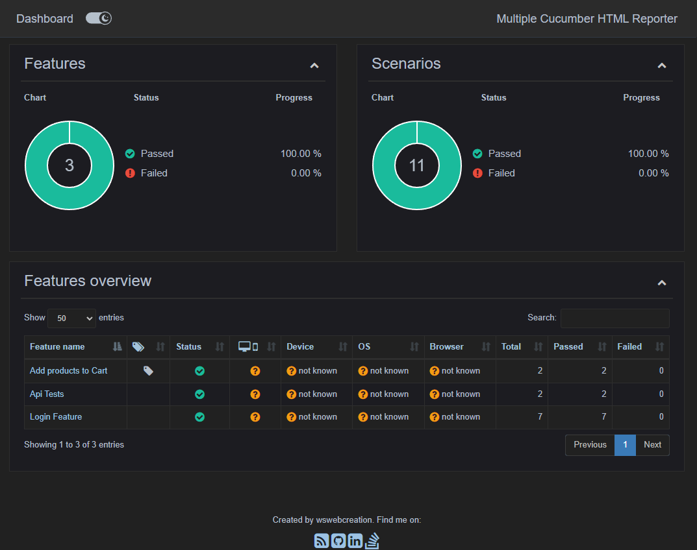

# Project Name
## ***Cypress.io Automation Framework***

## Description

This is a demo test automation framework created using cypress.io.

## Requirements
[Node.js (LTS)](https://nodejs.org/)

[VS Code](https://code.visualstudio.com/)

[GIT](https://git-scm.com/)

## AUT
[saucedemo site](https://www.saucedemo.com/) for UI automation

[reqres api](https://reqres.in/) for API automation

## Installation

If you clone this project you'll need to run the below command to install all the dependencies.

```
npm install
```
# Scripts to run the tests
```
npm run cy:open                 -   To open Cypress
npm run cy:run:on:chrome        -   To run tests on chrome with headed mode
npm run cy:run:on:edge          -   To run tests on edge with headed mode
npm run cy:run:headless         -   To run tests in headless mode
npm run cy:run:with:test:tag    -   To run tests with @test tag
npm run cy:report               -   To generate Multiple Cucumber HTML Report
npm run cy:parallel             -   To run tests in parallel
```

## Html Report
